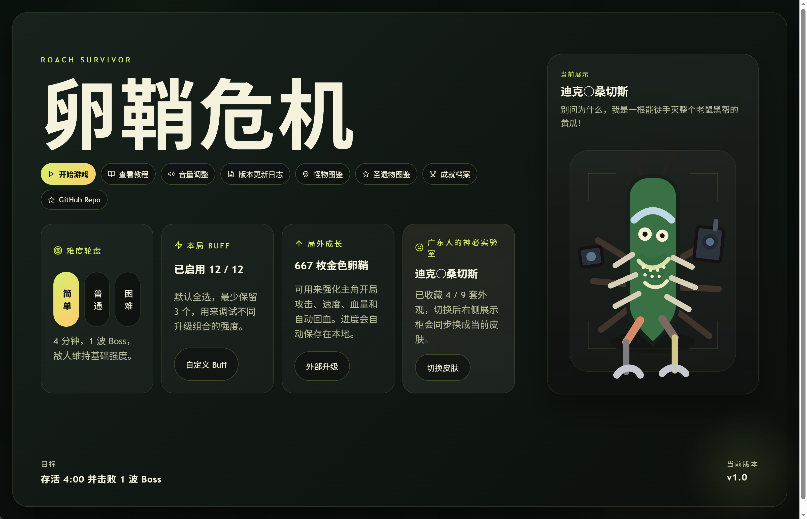

# Roach Survivor

这是一款发生在下水道的以可爱广东小精灵为主角的幸存者小游戏。

在这里生存下去的唯一途径就是不断移动、瞄准、升级、打 Boss，把金色卵鞘带回主菜单继续强化下一局。




## 怎么玩

- 活到本局目标时间，并击败所有 Boss 波次。
- 击杀敌人捡经验，升级时从 Buff / 圣遗物里选强化。
- Boss 和少数敌人会有特殊机制，硬贴脸很容易暴毙。
- 通关或击败 Boss 会获得金色卵鞘，可在主菜单购买局外升级和皮肤。
- 手机端可以试玩，会自动开启自瞄；完整体验仍推荐电脑端。

## 操作

- `WASD` / 方向键：移动
- 鼠标进入战场：接管瞄准
- `F`：切换自瞄
- `Esc`：释放鼠标瞄准
- `1` / `2` / `3`：选择升级或圣遗物
- `R`：刷新升级选项
- `P`：暂停
- 手机端：按住战场并朝目标方向拖动移动（暂时还不完善，推荐还是电脑端体验）

## 当前内容

- 4 档难度：简单、普通、困难 / 无尽
- 3 波 Boss，困难为完整三阶段挑战 , 无尽为每 2 分钟一波 Boss 持续挑战
- 12 个本局 Buff，可在开局前自定义启用池
- 8 项局外升级
- 成就档案、怪物图鉴、圣遗物图鉴、皮肤实验室
- localStorage 本地存档，旧 Cookie 存档会自动迁移

## 如何玩到？

### 试玩

请直接访问 Vercel 部署的镜像网站 [https://roach-survivor.vercel.app/](https://roach-survivor.vercel.app/) 试玩。

或者访问 [Cloudflare Pages 部署的镜像网站](https://roach.helicopter.lgbt) 试玩。

### 使用 Electron 打包的桌面应用进行游玩

请前往 [GitHub Releases](https://github.com/Moeary/Roach_Survivor/releases) 下载对应平台的安装包进行安装游玩。

### Docker 部署

从 DockerHub 拉取镜像：
```bash
docker run --rm -d -p 8080:8080 moeary/roach-survivor:latest
```

打开 `http://localhost:8080`。

### nodejs 本地开发运行

```bash
npm install
npm run dev
```

### Web 构建

```bash
npm run build
```

### Electron 打包

```bash
npm run electron:dist
npm run electron:dist:win
npm run electron:dist:linux
```

产物输出到 `release/`。

## 链接

- GitHub: https://github.com/Moeary/Roach_Survivor
- DockerHub: `moeary/roach-survivor`
